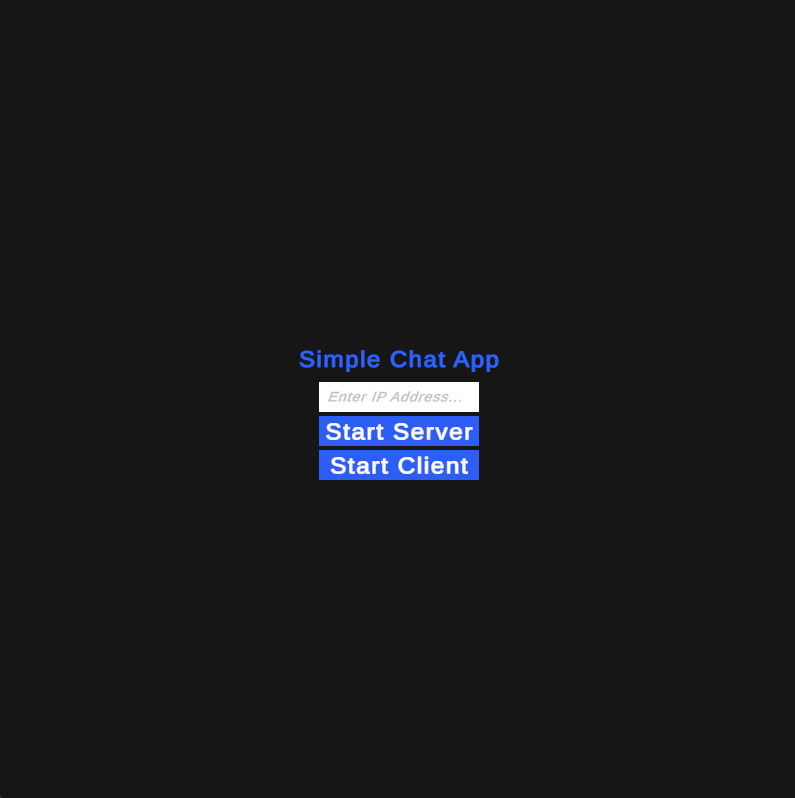
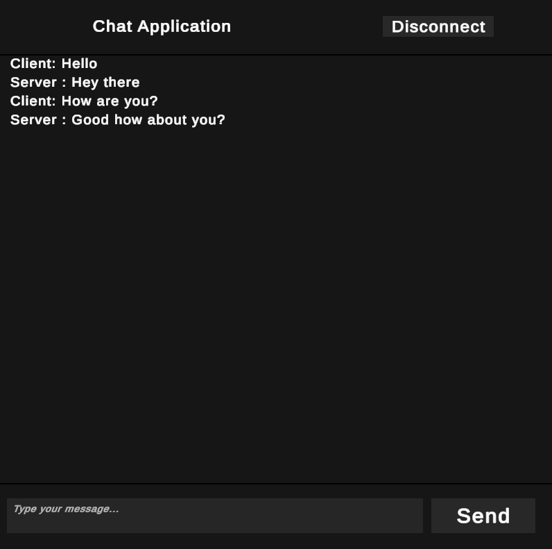

# 💬 Chat Application

**Chat Application** is a simple client/server messaging application built in **Unity / C#**.

The project allows one user to host a server while another user connects as a client using the server's **IP address**. Once connected, both sides can send messages to each other.

The project was created as an introduction to **network communication, client/server architecture and asynchronous application behaviour in C#**.

> Built with Unity and C#.

---

## 💬 How It Works

When the application starts, the user can choose to either:

- 🖥️ **Start Server**
- 💻 **Start Client**

The **server must always be started first** before a client can connect.

For local testing on the same computer, the application can use:

```text
127.0.0.1
```

This allows the Unity Editor and a standalone build of the application to communicate with each other.

```text
Server
   │
   │  IP Address
   │
   ↓
Client
```

Once the connection has been established, the server and client can exchange messages through the chat interface.

---

## 🕹️ Application Flow

```text
Launch Application
        ↓
Choose Server or Client
        ↓
 ┌───────────────┐
 │               │
Server          Client
 │               │
Start           Enter IP Address
 │               │
 └───────┬───────┘
         ↓
   Establish Connection
         ↓
      Chat Screen
         ↓
 Send / Receive Messages
```

---

## ✨ Features

- Client/server architecture
- IP-based connections
- Server hosting
- Client connection
- Two-way messaging
- Chat interface
- Connection management
- Separate client and server behaviour
- Unity UI
- C# networking logic
- Local testing using `127.0.0.1`

---

## 🧠 Client / Server Architecture

The application separates networking responsibilities between a **server** and a **client**.

### 🖥️ Server

The server acts as the host of the connection.

Once started, it waits for a client to connect.

After a connection has been established, the server can send and receive messages.

The server must be running before the client attempts to connect.

### 💻 Client

The client connects to the server using its IP address.

Once connected, it can communicate with the server through the chat interface.

This creates a simple architecture similar to:

```text
┌──────────────┐
│    SERVER    │
│              │
│ Send Message │
│ Receive      │
└──────┬───────┘
       │
       │ Network Connection
       │
┌──────▼───────┐
│    CLIENT    │
│              │
│ Send Message │
│ Receive      │
└──────────────┘
```

---

## 🛠️ Systems Implemented

The project includes systems for:

- Starting a server
- Starting a client
- Entering a server IP address
- Establishing a network connection
- Sending messages
- Receiving messages
- Updating the chat interface
- Managing separate server and client behaviour
- Switching between application screens
- Handling networking alongside Unity's main thread

---

## 🖥️ User Interface

The application begins with a simple connection menu.

The user can:

```text
Enter IP Address...

[ Start Server ]

[ Start Client ]
```

A server user starts hosting the application first.

The client then enters the correct IP address and connects to the running server.

Once connected, the application moves to the chat interface where messages can be exchanged.

For the interface to display correctly inside the Unity Editor, the Game view should be set to:

```text
800 x 800
```
---

## 📸 Screenshots

<p align="center">
  
   
</p>

---

## 💻 Technologies Used

| Technology | Usage |
|---|---|
| **Unity** | Application and UI development |
| **C#** | Networking and application logic |
| **Unity UI** | Menus and chat interface |

---

## 🎯 What I Learned

This project gave me experience with concepts that are different from a traditional single-player Unity game.

In particular, I worked with:

- Client/server architecture
- Network communication
- IP-based connections
- Sending data between applications
- Separating client and server responsibilities
- Asynchronous application behaviour
- Updating Unity UI from networking systems
- Structuring a Unity project around networking rather than gameplay

The project helped me better understand the basic architecture behind applications where multiple running programs need to communicate with each other.

---

## 📦 Running the Project

### Opening the Project

1. Clone this repository.
2. Open **Unity Hub**.
3. Select **Add project from disk**.
4. Select the cloned `ChatApplication` folder.
5. Open the project.
6. Open the `Scenes` folder.
7. Double-click **ChatAppScene**.
8. Set the Unity Game view resolution to **800 x 800**.
9. Press **Play**.

---

### 🖥️ Testing Locally

The easiest way to test the application is to run one instance inside the **Unity Editor** and another as a **standalone build**.

For local testing, use:

```text
127.0.0.1
```

### Step 1 — Start the Server

Inside the Unity Editor:

1. Enter `127.0.0.1` into the IP input field.
2. Click **Start Server**.

> The server must always be started before the client.

### Step 2 — Start the Client

Open the standalone build of the application.

1. Enter `127.0.0.1` into the IP input field.
2. Click **Start Client**.
3. The client should connect to the running server.

Once connected, messages can be sent from both the server and client.

```text
Unity Editor
   SERVER
     │
     │ 127.0.0.1
     │
     ▼
Standalone Build
   CLIENT
```

The setup can also be reversed:

```text
Standalone Build
   SERVER
     │
     │ 127.0.0.1
     │
     ▼
Unity Editor
   CLIENT
```

The important requirement is that the **server is started first** before the client attempts to connect.

---

### 🌐 Connecting Using an IP Address

The client connects by entering the IP address of the machine running the server.

```text
Server Machine
      │
      │ Server IP Address
      ▼
Client Machine
```

The server must already be running before the client attempts to connect.
